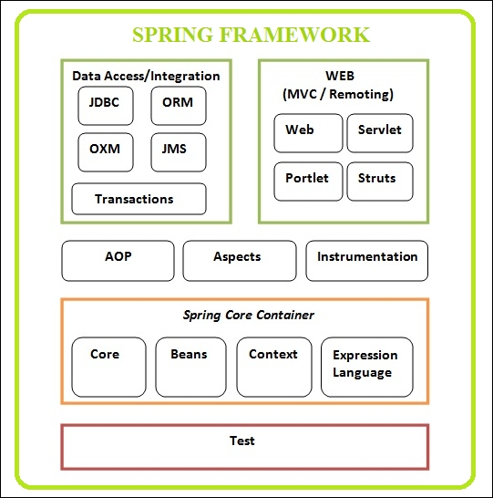

# Spring Framework Fundamentals

Its always difficult to get started when comes to new things. This project is all about how one can start to understand spring framework.
First come first, basics are always important.

Spring Core container conatins the beans i.e. the objects that form the backbone of your application and that are managed by the Spring IoC container are called beans. This project highlights the use of,
1. IOC Inversion of control
2. Dependency Injection
3. Creating beans using XML
4. Creating beans using Java Annotations
5. Creating beans using Java source code

# Internal Working

                |     incoming request
                |   -------------->   Front Controller  (Dispatcher servlet) -> already developed by spring dev team  - it delegates request to other model objects
                |                           |
        web     |                           |   Model (pojos, beans)
        Browser |                           >
                |                      Controller  (actual business logic resides here)
                |                           |
                |                           |   Model
                |                           >
                |    <--------------    View template   (html page e.g. jsp)
                

# Components of spring MVC
  1. Set of web pages UI components
  2. Collection of spring beans (controllers, services)
  3. Spring configuration (xml or java annotation)
  
# What is Controller
    - Handle the request
    - Store/retrieve data
    - place data in model
    - send to appropriate view template
    
# Inversion of Control
// Inversion of Control (to give control of creation and management of object to someone else)
  
        My Application --------> give me coach object ---> object Factory --->       configuration
                                <----returns object-----  (Spring Container)           /     |    \
                                                                               baseball  hockey  Cricket Coach
                                                                               Coach       Coach

SPRING CONTAINER HELPS In,
   - Making my application configurable as using beans can get any object no need to hardcode and call different Coach implementation.
   - Easy change theCoach object implementation to any sports.

 Configuration can be done in three ways:
  1. XML configuration file
  2. JAva annotations
  3. Java Source Code

  Development process
  Step1. Configure your spring beans
                <beans -->
                    <bean id = "myCoach"  class ="com.luv2code.springDemo.BaseBallCoach">
                    </bean>
                </beans>
  Step2. Create a spring container  (Application Context)
         - ClassPathXMLApplicationContext
              ClassPathXMLApplicationContext context = new ClassPathXMLApplicationContext("ApplicationContext.xml");
         - AnnotationConfigApplicationContext
         - GenericWebApplicationContext
  Step3. Retrieve beans from spring container
         Coach theCoach = context.getBeans("myCoach",Coach.class);

# Spring Beans
   - default scope of bean is Singleton (other scopes: singleton, prototype, request, session, global-session).
   - i.e. one instance is created
   - Cached in memory
   - all request for bean will return a shared reference of the same bean.
   - bean scope=""
   - For "prototype" scoped beans, Spring does not call the destroy method.
   - In contrast to the other scopes, Spring does not manage the complete lifecycle of a prototype bean.
     Lifecycle:  the container instantiates, configures, and otherwise assembles a prototype object, and hands it to the client, with no further record of that prototype instance.
   - Thus, although initialization lifecycle callback methods are called on all objects regardless of scope, in the case of prototypes, configured destruction lifecycle callbacks are not called.
   - Can destroy in case of prototype but custom code is required.

 # Bean lifecycle
        container started  ---> bean instantiated --> dependency injected --> Internal spring processing ----> your custom init method --->  bean is ready for use/ container shutdown  -----> custom destroy method executed when app or lifecycle is over

 # Custom initialisation code  
    - <bean init-method="" >
    - calling custom buisness logic
    - setting up handles to resources (db, socket files, etc)

 # custom destroy method 
     - <bean destroy-method="" >
     - calling custom buisness logic
     - clean up handles to resources (db, socket files, etc)
     
 # Dependency Injection
The Client delegates calls to another object the responsibility of providing its dependencies. Outsource construction of objects.
- Inversion of control: create and manages object
- DI: Inject or provide object's dependencies.

Types of Injection:
	- Constructor Injection
	- Setter Injection
  - Field Injection (Accomplished using JAVA Reflection. Applies directly on field on need of setter method.)

Constructor Injection Steps
s1. Define the dependency interface and class (Fortune Service and Happy Fortune Service)
s2. Create a constructor in your class for injection
s3. Configure the DI in spring config file.
     
 # About Packages
 - package com.springcorefunctionality.springDemo -> Demonstrates need to hardcode different object creation for different Implementation vs using IOC using XML file
 - package com.springcorefunctionality.springDemoDI -> Demonstrates simple DI usecase using XML file
 - package com.springcorefunctionality.javaAnnotations -> Demonstrates IOC using Java Annotation
 - package com.springcorefunctionality.javaAnnotationsDI -> Demonstrates DI using constructor, setter method and field injection
 - package com.springcorefunctionality.javaAnnotationQualifier -> When using Autowired if multiple implementaion of service exist. We can use Qualifier to pick the implementation
 - package com.springcorefunctionality.javaNoXML -> Demonsrates, We can configure IOC and DI without using XML, totally java code. Its done using @Bean.
 
 # Build And Run
 - Download the project
 - Run mvn clean build
 - Each module has main method defined. Right click and 'Run as Java Application'
 
